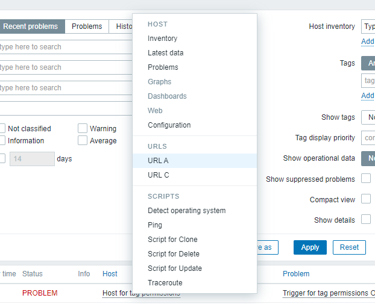

### Modules

Request for new example can be left as issue for this repository, will do my best to implement if it is possible.
### Extending host popup menu

  
Action extends host popup menu with urls from it inventory `url_a`, `url_b` and `url_c` fields. At the moment only one module can extend popup menu. 
Required files:  
```
    actions
        MenuPopupExtendedAction.php
```
`maniest.json` file required changes:
```
    "actions": {
		"menu.popup": {
			"class": "MenuPopupExtendedAction",
			"layout": "layout.json"
		}
	}
```